# **Ejercicio**: Consultas básicas en base de datos de ventas
Ejercicio práctico para aplicar los conceptos aprendidos.
| Autor            | Fecha        | Día |
|------------------|--------------|----------|
| **Carlos Vásquez** |07 Noviembre 2025 | 2 |
## Crear esquema básico:

```sql
-- Crear tabla de clientes
CREATE TABLE clientes (
    id INTEGER PRIMARY KEY,
    nombre VARCHAR(100) NOT NULL,
    email VARCHAR(100) UNIQUE,
    fecha_registro DATE NOT NULL
);
```

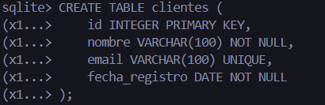
```sql
-- Crear tabla de productos
CREATE TABLE productos (
    id INTEGER PRIMARY KEY,
    nombre VARCHAR(100) NOT NULL,
    precio DECIMAL(10,2) NOT NULL,
    stock INTEGER DEFAULT 0,
    categoria VARCHAR(50)
);
```
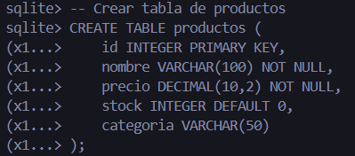
```sql
-- Crear tabla de pedidos
CREATE TABLE pedidos (
    id INTEGER PRIMARY KEY,
    cliente_id INTEGER,
    fecha_pedido DATE NOT NULL,
    total DECIMAL(10,2),
    FOREIGN KEY (cliente_id) REFERENCES clientes(id)
);
```
## En la Tabla pedidos hay que hacer un cambio debido que en el ejercicio anterior quedo asi
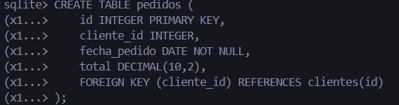

## Entonces habria que cambiar campos Renombra la tabla actual para conservar los datos temporalmente:
```sql
ALTER TABLE productos RENAME TO productos_old;
```
```sql
DROP TABLE productos_old;
```
## Al hacer el cambio de algunos campos la sentencia quedaría asi:
```sql
CREATE TABLE productos (
    id INTEGER PRIMARY KEY,
    nombre TEXT NOT NULL,
    precio REAL NOT NULL,
    categoria TEXT,
    stock INTEGER DEFAULT 0
);
```
## Insertar los datos
```sql
INSERT INTO productos (id, nombre, precio, categoria, stock)
VALUES
(1, 'Laptop Dell', 1200.00, 'Electrónica', 15),
(2, 'Mouse Logitech', 25.50, 'Accesorios', 50),
(3, 'Teclado Mecánico', 89.99, 'Accesorios', 30),
(4, 'Monitor 24"', 199.99, 'Electrónica', 12),
(5, 'Audífonos Sony', 149.50, 'Audio', 25);
```

## Consultas básicas:

```sql
-- Seleccionar productos con precio > 100
.mode column
.headers on
SELECT nombre, precio FROM productos WHERE precio > 100;

```
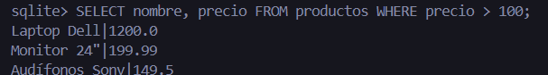
```sql
-- Productos de categoría 'Electrónica' ordenados por precio descendente
.mode column
.headers on
SELECT nombre, precio, categoria FROM productos
WHERE categoria = 'Electrónica'
ORDER BY precio DESC;

```
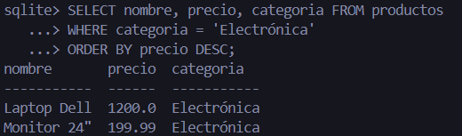
```sql
-- Productos con stock entre 10 y 40, ordenados por stock ascendente
.mode column
.headers on
SELECT nombre, stock, precio FROM productos
WHERE stock BETWEEN 10 AND 40
ORDER BY stock ASC;
```
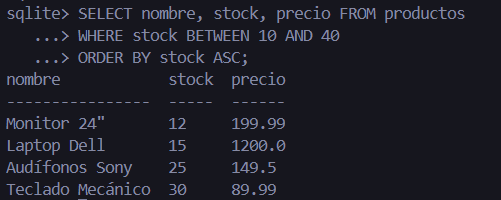
```sql
-- Nombres que contienen 'a' ordenados alfabéticamente
.mode column
.headers on
SELECT nombre, precio FROM productos
WHERE nombre LIKE '%a%'
ORDER BY nombre ASC;

```
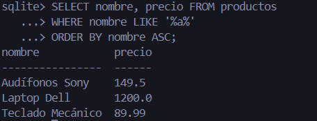

## Experimentar Variaciones
### Cambia condiciones WHERE
### Prueba diferentes columnas en ORDER BY
### Combina múltiples condiciones con AND/OR

```sql
-- Seleccionar productos con precio < 100
.mode column
.headers on
SELECT nombre, precio FROM productos WHERE precio < 100;
```
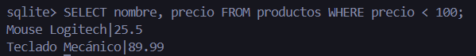

```sql
-- Productos de categoría 'Accesorios' ordenados por precio ascendente
.mode column
.headers on
SELECT nombre, precio, categoria FROM productos
WHERE categoria = 'Accesorios'
ORDER BY precio ASC;
```
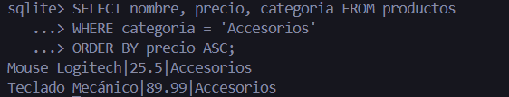

```sql
-- Productos con stock entre 20 y 50, ordenados por stock descendente
.mode column
.headers on
SELECT nombre, stock, precio FROM productos
WHERE stock BETWEEN 20 AND 50
ORDER BY stock DESC;
```
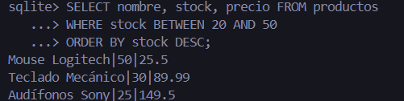
--Muestra productos de las categorías Accesorios o Audio que tengan más de 20 en stock, ordenados por precio
```sql
.mode column
.headers on
SELECT nombre, stock, precio, categoria
FROM productos
WHERE (categoria = 'Accesorios' OR categoria = 'Audio')
  AND stock > 20
ORDER BY precio DESC;

```
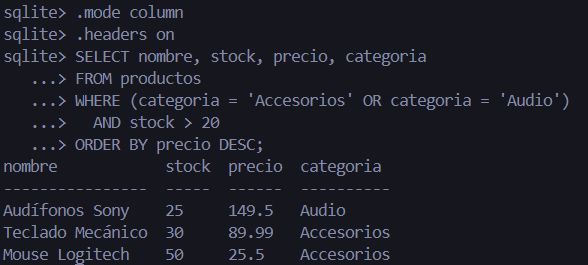
```sql
-- Nombres que contienen 'o' ordenados alfabéticamente
.mode column
.headers on
SELECT nombre, precio FROM productos
WHERE nombre LIKE '%o%'
ORDER BY nombre DESC;
```
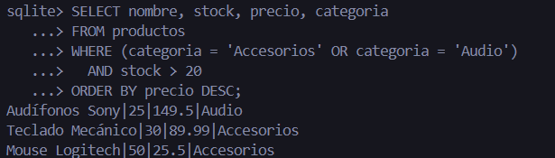

## Evidencia del quiz terminado
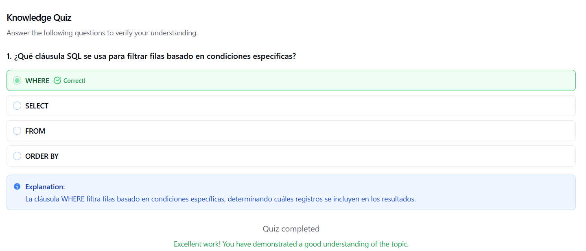